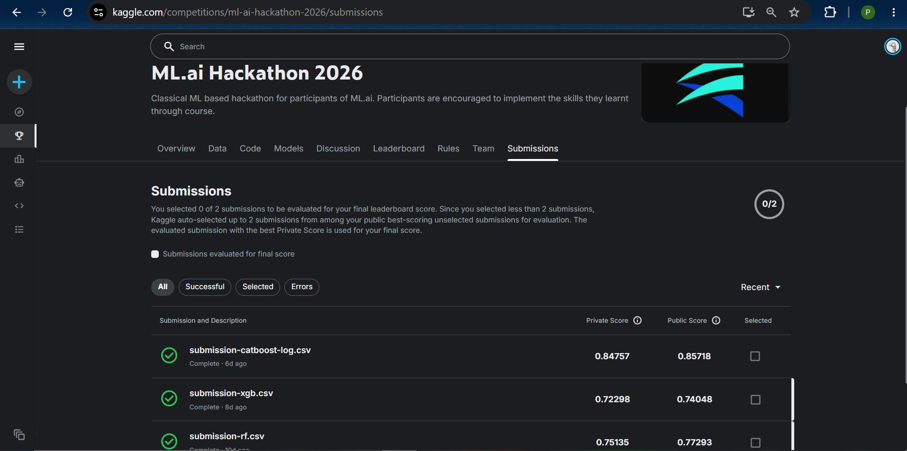

# ML.ai Hackathon 2026 – Video Game Revenue Prediction

This repository contains my solution for the **ML.ai Hackathon 2026**, organized as the final hackathon of the **Machine Learning.AI** course conducted by **IITG.ai Club**.

The objective of the competition was to predict the **estimated revenue (in million USD)** of unseen video games using metadata such as platform, publisher, critic ratings, release information, and other engineered features.

Competition:
https://www.kaggle.com/competitions/ml-ai-hackathon-2026/overview

---

## Competition Overview

**Problem Type:** Supervised Machine Learning (Regression)

**Evaluation Metric:** Root Mean Squared Logarithmic Error (RMSLE)

> Lower RMSLE indicates better model performance.

The competition introduced practical challenges including:
- Missing values
- Feature engineering
- Categorical variables
- Temporal shifts
- Model selection & hyperparameter tuning

---

## Models Implemented

I experimented with multiple ensemble learning algorithms and compared their performance.

| Model | Private RMSLE |
|--------|--------------:|
| Random Forest | **0.75135** |
| XGBoost | **0.72298** ⭐ |
| CatBoost | **0.84757** |

Among the three approaches, **XGBoost** achieved the best validation performance on the competition leaderboard.

---

## Competition Result

🏆 **Final Rank:** **35 / 77 Teams**

🎖️ Awarded a **Certificate of Excellence** for finishing in the **Top 10%** of participants in the 6-week Machine Learning course organized by IITG.ai Club.




---

## Repository Structure

```
.
├── data/
│   ├── train_games.csv
│   ├── test_features.csv
│   ├── yearly_trends.csv
│   ├── platform_summary.csv
│   ├── publisher_summary.csv
│   └── genre_summary.csv
│   
│
├── models/
│   ├── random-forest.ipynb
│   ├── xgboost.ipynb
│   └── catboost.ipynb
│
├── submissions/
│   ├── submission-rf.csv
│   ├── submission-xgb.csv
│   ├── submission-catboost-log.csv
│   ├── ML.ai-Hackathon-Certificate.png
│   └── Hackathon-Kaggle-Score.jpg
│
└── README.md
```

---

## Workflow

The overall pipeline followed during the competition:

1. Data preprocessing
2. Handling missing values
3. Feature engineering
4. Categorical encoding
5. Model training
6. Hyperparameter tuning
7. Model evaluation using RMSLE
8. Kaggle submission & leaderboard analysis

---

## Key Learnings

Through this hackathon I gained hands-on experience with:

- End-to-end machine learning workflows
- Ensemble tree-based models
- Feature engineering
- Model comparison
- Regression evaluation metrics (RMSLE)
- Kaggle competition workflow
- Iterative experimentation and model improvement

One of the biggest takeaways was that **there is no universally best model**, performance depends heavily on the dataset, preprocessing strategy, and feature engineering.

---

## Tech Stack

- Python
- Pandas
- NumPy
- Scikit-learn
- XGBoost
- CatBoost
- Matplotlib
- Kaggle

---

## Acknowledgements

This project was completed as part of the **ML.ai Hackathon 2026**, organized by **IITG.ai Club** during the **MachineLearning.ai** course.

The hackathon provided valuable practical experience in applying classical machine learning techniques to a real-world regression problem.

---

## License

This repository is shared for educational purposes.